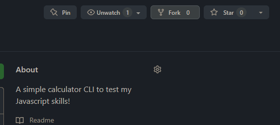
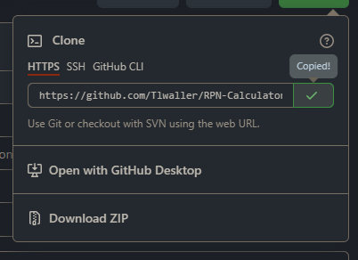
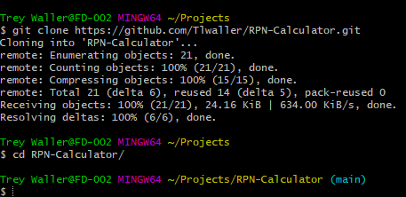
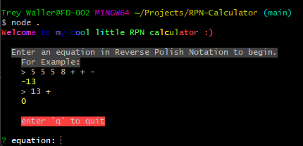

# RPN-Calculator

This project is a simple calculator CLI app, which uses Reverse Polish Notation to make it easier for computers to compile.
This was a fun little challenge to take on as it was my first time creating a CLI, so I had to learn how to get user input through the console (I chose Inquirer as there were some pretty informative videos on YouTube about it) but it also wasn't quite my first rodeo with Javascript or even NodeJs, so it was fairly easy to get the swing of things.

# Installing and running this project

First, fork and clone this repository to your machine.

    

    

    

Next, cd into the project and run `npm install`

    

Now you're ready to start using the calculator. Spin it up by running `node .` and start mathing!
You can exit the app any time simply by entering 'q'.

    

    

